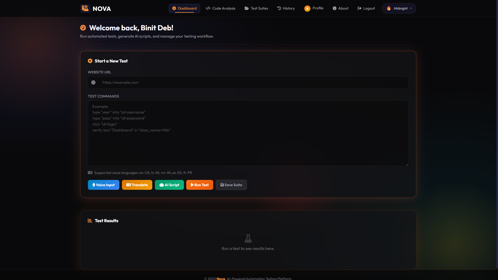

<div align="center">


# Nova — AI-Powered Automation Testing Platform

**A full-stack web application that combines Selenium browser automation, a local Ollama LLM, and a premium glassmorphism UI to make software testing faster, smarter, and fully offline-capable.**

[](https://python.org)
[](https://flask.palletsprojects.com)
[](https://selenium.dev)
[](https://docs.celeryq.dev)
[](https://redis.io)
[](https://sqlite.org)
[](https://www.docker.com)
[](LICENSE)

<br/>


</div>

---

## 📖 Overview

**Nova** (originally **TestVerse**) is a final-year CSE project that demonstrates a production-quality AI-powered testing platform. It covers both **black-box** (UI/browser automation) and **white-box** (code analysis) testing, wrapped in a sleek dark-mode interface with real-time visual feedback.

> **No cloud AI keys required.** Nova uses [Ollama](https://ollama.com) to run large language models **locally on your machine**, plus a custom **Mini LLM** (tiny transformer + keyword retrieval) bundled in the repo as a fallback.

The platform lets you:
- Write test commands in **plain English or any language** and run them against any website
- Let the **AI generate an entire test script** from just a URL and a goal sentence
- **Review Python code** for bugs, security issues, and get auto-generated unit tests
- Run long tests asynchronously via **Celery workers** without blocking the UI
- Store all results, download PDF/Excel reports, and track your history over time

---

## 🚀 Features

### 🖤 Black-Box Testing (UI / Browser Automation)

| Feature | Description |
|---|---|
| **AI Script Generation** | Describe your test goal in plain English → Ollama LLM inspects the site and writes a ready-to-run Selenium script |
| **Natural Language Translation** | Type step-by-step instructions in any language; the AI converts them to the structured command format |
| **Voice Input** | Dictate test commands hands-free using the Web Speech API — supports `en-US`, `hi-IN`, `mr-IN`, `es-ES`, `fr-FR` |
| **Visual Regression Testing** | Save pixel-perfect baseline screenshots and automatically detect any unintended visual changes |
| **AI Bug Assistant** | When a step fails, the AI analyses the error and returns a **Probable Cause** + **Suggested Fix** |
| **Async Test Execution** | Long-running tests are dispatched to a **Celery worker** (backed by Redis), keeping the UI responsive |
| **Cinematic Loading Overlay** | Premium full-screen overlay with 3-ring neon spinner, animated step tracker, and terminal-style command ticker |

### ⬜ White-Box Testing (Code Analysis)

| Feature | Description |
|---|---|
| **AI Code Reviewer** | Paste any Python function → get a structured AI report covering bugs, security, performance & best practices |
| **AI Unit Test Generator** | Automatically generate a complete `pytest` suite for any given function |
| **AI Code Refactoring** | Clean up and optimise messy code with a single click |

### 📋 Workflow & Reporting

| Feature | Description |
|---|---|
| **Persistent Test History** | Every test run is saved to your account with date, URL, and status |
| **Save & Re-run Test Suites** | Save named test scripts and reload them into the dashboard with one click |
| **PDF Reports** | Download beautifully formatted PDF reports for both test runs and code analysis |
| **Excel Reports** | Export step-by-step results as `.xlsx` spreadsheets |
| **User Profiles & Stats** | See your pass rate, total runs, and test suite count at a glance |
| **Dark / Light Mode** | System-wide theme toggle persisted in `localStorage` |
| **Rate Limiting & CSRF Protection** | Built-in Flask-Limiter and Flask-WTF CSRF protection on all endpoints |

---

## 🤖 AI Architecture

Nova uses a **three-tier AI stack**, falling back gracefully when the previous tier is unavailable:

```
User Request
     │
     ▼
┌─────────────────────────────────────────┐
│  1. Ollama (Primary)                    │
│     Local LLM via HTTP API              │
│     Default model: llama3.2             │
│     Configure via OLLAMA_BASE_URL /     │
│     OLLAMA_MODEL in .env                │
└──────────────┬──────────────────────────┘
               │  (if Ollama not running)
               ▼
┌─────────────────────────────────────────┐
│  2. Mini LLM — Retrieval Layer          │
│     Keyword-similarity search over a    │
│     curated Q&A dataset (dataset.txt)   │
│     Fast, deterministic, zero-latency   │
└──────────────┬──────────────────────────┘
               │  (if no retrieval match)
               ▼
┌─────────────────────────────────────────┐
│  3. Mini LLM — Neural Generator         │
│     Tiny Transformer (PyTorch)          │
│     Weights: app/ai/model.pth           │
│     Retrain: python -m app.ai.train     │
└─────────────────────────────────────────┘
```

---

## 🛠️ Tech Stack

### Backend
- **Python 3.11** — Core language
- **Flask 3.0** — Web framework with application factory pattern & blueprints
- **Flask-SQLAlchemy 3.1** — ORM with SQLite (dev) / PostgreSQL (prod) support
- **Flask-Migrate 4.0** — Database schema migrations via Alembic
- **Flask-Login 0.6** — Session-based authentication
- **Flask-Limiter 3.5** — Rate limiting on API endpoints
- **Flask-Compress 1.15** — Gzip response compression
- **Flask-WTF 1.2** — CSRF protection
- **Celery 5.3** — Distributed task queue for async test execution
- **Redis 7** — Message broker & result backend for Celery
- **Selenium 4.14** — Headless Chrome browser automation
- **webdriver-manager 4.0** — Automatic ChromeDriver management (no manual PATH setup)
- **Ollama** — Local LLM server (runs `llama3.2` or any compatible model)
- **PyTorch (CPU)** — Powers the bundled Mini LLM neural generator
- **FPDF2** — PDF generation for test reports
- **PDFKit** — Wkhtmltopdf-based PDF for code analysis reports
- **OpenPyXL** — Excel report generation
- **Pillow** — Image processing for visual regression testing
- **Gunicorn + gevent** — Production WSGI server (async workers)

### Frontend
- **HTML5 / Vanilla CSS / JavaScript** — No frontend framework dependency
- **Bootstrap 5.3** — Grid and component base
- **Inter (Google Fonts)** — Primary typeface
- **Font Awesome 6.5** — Icon set
- **Highlight.js** — Syntax highlighting in code analysis
- **Web Speech API** — In-browser voice recognition

### Database Schema

```
User          → id, email, password (hashed), name
TestRun       → id, url_tested, status, timestamp, results_json, user_id
TestCase      → id, name, commands_json, timestamp, user_id, baseline_images_json
```

---

## 📁 Project Structure

```
Test_Verse/
├── run.py                      # App entry point
├── celery_worker.py            # Exposes Celery instance for worker process
├── config.py                   # DevelopmentConfig / ProductionConfig
├── requirements.txt            # Python dependencies
├── Dockerfile                  # Multi-stage Docker image
├── docker-compose.yml          # Web + Celery Worker + Redis services
├── build.sh                    # Helper build script
├── .env                        # Environment variables (not committed)
├── .env.example                # Template for environment variables
│
└── app/
    ├── __init__.py             # App factory (Flask, SQLAlchemy, Celery, extensions)
    ├── utils.py                # PDF/Excel generators, shared helpers
    │
    ├── ai/                     # AI layer (never imported directly by routes)
    │   ├── ollama_client.py    # HTTP client for Ollama API (primary AI)
    │   ├── mini_llm.py         # Retrieval + Tiny Transformer (offline fallback)
    │   ├── router.py           # Routes prompts: Ollama → Mini LLM
    │   ├── engine.py           # High-level AI engine interface
    │   ├── train.py            # Mini LLM training script
    │   ├── dataset.txt         # Q&A dataset for retrieval layer
    │   └── model.pth           # Pre-trained Mini LLM weights
    │
    ├── models/                 # SQLAlchemy models (one file per model)
    │   ├── user.py             # User model
    │   ├── test_run.py         # TestRun model
    │   └── test_case.py        # TestCase model
    │
    ├── routes/                 # Flask blueprints
    │   ├── auth.py             # Authentication (login, register, password reset)
    │   ├── main.py             # Landing page, dashboard, profile, history
    │   ├── test_api.py         # Test execution & AI script APIs
    │   └── export_api.py       # PDF / Excel export endpoints
    │
    ├── services/               # Business logic (routes call services, not AI directly)
    │   ├── ai_service.py       # AI-powered operations (script gen, code analysis)
    │   ├── test_service.py     # Selenium test runner (Celery tasks)
    │   └── report_service.py   # Report generation helpers
    │
    ├── static/
    │   ├── css/
    │   │   └── style.css       # Full design system (dark/light mode, glassmorphism)
    │   └── js/
    │       ├── dashboard.js    # Test runner, voice, TLO overlay, AI script modal
    │       └── analysis.js     # Code analysis page logic
    │
    └── templates/
        ├── base.html           # Base layout (navbar, overlay, theme toggle, toasts)
        ├── index.html          # Landing / hero page
        ├── dashboard.html      # Main testing interface
        ├── code_analysis.html  # White-box code analysis page
        ├── test_suites.html    # Saved test suites manager
        ├── history.html        # Test run history with stats
        ├── profile.html        # User profile & account settings
        ├── errors/
        │   ├── 404.html
        │   └── 500.html
        └── auth/
            ├── login.html
            ├── register.html
            ├── forgot_password.html
            └── reset_password.html
```

---

## ⚙️ Command Syntax

Test commands follow a structured natural-language DSL:

```
# Navigation
navigate "https://example.com"

# Typing into form fields
type "username" into "id=username"
type "password" into "name=password"
type "search term" into "class_name=search-input"
type "value" into "xpath=//input[@placeholder='Email']"

# Clicking elements
click "id=login-button"
click "link_text=Sign In"
click "xpath=//button[contains(text(), 'Submit')]"

# Assertions
verify text "Dashboard" in "class_name=page-title"
verify text "Welcome" in "tag_name=h1"

# Waiting
wait 2
```

**Supported locator strategies:** `id`, `name`, `class_name`, `xpath`, `css_selector`, `link_text`, `tag_name`

---

## 🔌 API Reference

All endpoints require authentication (`@login_required`). JSON in/out unless noted.

| Method | Endpoint | Description |
|---|---|---|
| `POST` | `/run-test` | Execute test commands against a URL (dispatches to Celery) |
| `POST` | `/generate-script` | AI-generate a test script from URL + goal |
| `POST` | `/translate` | Translate natural language → command format |
| `POST` | `/save-test-case` | Save a named test suite |
| `POST` | `/approve-baseline` | Approve visual regression baseline screenshots |
| `POST` | `/analyze-code` | AI code review / bug analysis |
| `POST` | `/generate-tests` | AI unit test generation |
| `POST` | `/refactor-code` | AI code refactoring |
| `POST` | `/export/pdf` | Download test results as PDF |
| `POST` | `/export/excel` | Download test results as Excel |
| `GET`  | `/download-history/<id>` | Download historical test run as PDF |
| `GET`  | `/download-excel/<id>` | Download historical test run as Excel |
| `POST` | `/delete-history/<id>` | Delete a test run from history |
| `POST` | `/delete-test-case/<id>` | Delete a saved test suite |
| `POST` | `/change-password` | Update account password |
| `POST` | `/clear-history` | Delete all test history for current user |

---

## 🖥️ Local Setup

### Prerequisites

- **Python 3.11+**
- **Google Chrome** browser
- **[Ollama](https://ollama.com/download)** — local AI server *(required for AI features)*
- *(Optional)* **Redis** — required only if you want true async Celery workers; set `CELERY_TASK_ALWAYS_EAGER=True` to skip it for local development
- *(Optional)* **[wkhtmltopdf](https://wkhtmltopdf.org/downloads.html)** — for code-analysis PDF export

> ChromeDriver is managed **automatically** by `webdriver-manager`. No manual PATH setup needed.

---

### 1. Clone the Repository

```bash
git clone https://github.com/BinitDeb7/NOVA.git
cd NOVA
```

### 2. Create & Activate a Virtual Environment

```bash
# Windows
python -m venv venv
venv\Scripts\activate

# macOS / Linux
python3 -m venv venv
source venv/bin/activate
```

### 3. Install Dependencies

```bash
pip install -r requirements.txt
```

> ⚠️ `torch` (CPU build) is included in requirements. The install may take a few minutes.

### 4. Configure Environment Variables

Copy `.env.example` to `.env` and fill in your values:

```bash
cp .env.example .env
```

```env
# Flask
SECRET_KEY=your_long_random_secret_key_here

# Database (SQLite for local dev, PostgreSQL for production)
DATABASE_URL=sqlite:///database.db

# Celery / Redis
CELERY_BROKER_URL=redis://localhost:6379/0
CELERY_RESULT_BACKEND=redis://localhost:6379/0
# Set to True to run tests synchronously WITHOUT a Celery worker (local quick-start)
CELERY_TASK_ALWAYS_EAGER=True

# Ollama AI (local)
OLLAMA_BASE_URL=http://localhost:11434
OLLAMA_MODEL=llama3.2
```

> ⚠️ **Never commit your `.env` file.** It is already listed in `.gitignore`.

### 5. Set Up Ollama (AI)

```bash
# Install Ollama from https://ollama.com/download, then:
ollama serve          # start the Ollama server
ollama pull llama3.2  # download the default model (~2 GB)
```

The Mini LLM fallback works without Ollama - it will activate automatically if Ollama is not running.

### 6. Run Database Migrations

```bash
flask db upgrade
```

> If this is a fresh install and no `migrations/` history exists yet, run `flask db init` first (only once).

### 7. Run the Application

```bash
python run.py
```

Open [http://127.0.0.1:5000](http://127.0.0.1:5000) in your browser.

> **Optional — start a Celery worker** (only needed if `CELERY_TASK_ALWAYS_EAGER=False`):
> ```bash
> celery -A celery_worker.celery worker --loglevel=info
> ```

---

## 🐳 Docker Deployment

The included `docker-compose.yml` spins up three services: **web**, **celery_worker**, and **redis**.

```bash
docker-compose up --build
```

The app will be available at [http://localhost:5000](http://localhost:5000).

> **Ollama with Docker**: The Docker Compose config connects to Ollama running on your **host machine** via `host.docker.internal:11434`. Make sure `ollama serve` is running on your host before starting Docker.

To update the AI model used inside Docker, edit the `OLLAMA_MODEL` environment variable in `docker-compose.yml`.

---

## 🖼️ Screenshots

### Dashboard — Start a Test


### Test Results with AI Bug Assistant


### Test History


### PDF Test Report


### Visual Regression Testing


### White-Box Code Analysis


---

## 🔒 Authentication Flow

```
Register (name, email, password)
    ↓
Login → session cookie (Flask-Login)
    ↓
All routes protected by @login_required
    ↓
Logout / Forgot Password → Reset via email token
```

Passwords are hashed with **PBKDF2 + SHA-256** via Werkzeug. No plain-text passwords are ever stored.

---

## 🚢 Production Deployment

### Gunicorn (manual)

```bash
gunicorn -w 2 -k gevent --worker-connections 4 --timeout 300 -b 0.0.0.0:8000 run:app
```

### Cloud Platforms (Render, Railway, Fly.io)

1. Set environment variables in the platform dashboard (`SECRET_KEY`, `DATABASE_URL`, `CELERY_BROKER_URL`, `CELERY_RESULT_BACKEND`, `OLLAMA_BASE_URL`, `OLLAMA_MODEL`)
2. Set the start command to the Gunicorn command above
3. Add a Redis add-on (or use Upstash Redis) and set `CELERY_BROKER_URL` / `CELERY_RESULT_BACKEND`
4. For Ollama on cloud: deploy an Ollama container separately and point `OLLAMA_BASE_URL` to it, or set `CELERY_TASK_ALWAYS_EAGER=True` to use only the Mini LLM fallback

---

## 🔧 Retraining the Mini LLM

The bundled `model.pth` is pre-trained on `app/ai/dataset.txt`. To add domain-specific Q&A pairs and retrain:

1. Edit `app/ai/dataset.txt` — add `Q: ...\nA: ...` blocks
2. Run the training script:
   ```bash
   python -m app.ai.train
   ```
3. The new `model.pth` will be saved automatically.

---

## 🤝 Contributing

Pull requests are welcome! For major changes, please open an issue first to discuss what you'd like to change.

1. Fork the repository
2. Create your feature branch (`git checkout -b feature/AmazingFeature`)
3. Commit your changes (`git commit -m 'Add AmazingFeature'`)
4. Push to the branch (`git push origin feature/AmazingFeature`)
5. Open a Pull Request

---

## 📄 License

Distributed under the **MIT License**. See [`LICENSE`](LICENSE) for more information.

---

## 👨‍💻 Author

**Binit Deb** - Final Year B.Tech CSE Project  
[GitHub](https://github.com/BinitDeb7) · [LinkedIn](https://www.linkedin.com/in/binitdeb/)

---

<div align="center">

Made with ❤️ by Binit Deb &nbsp;|&nbsp; Powered by Ollama AI + Selenium

</div>
